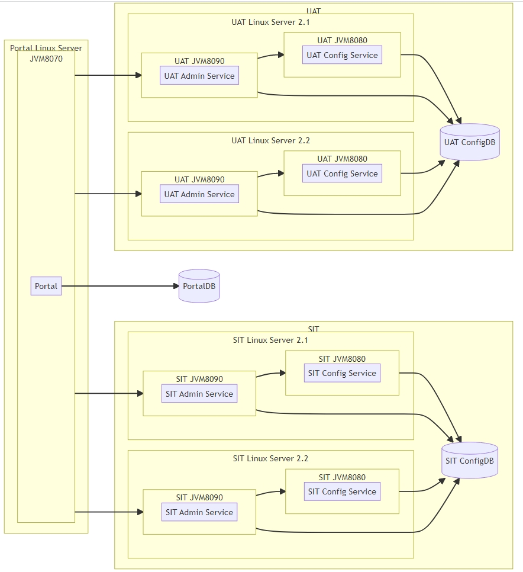

# Apollo部署说明
Apollo 配置中心 是携程开源的一个分布式配置管理平台，它可以集中管理不同环境、不同集群的配置，具有实时推送、版本管理、灰度发布等特性;本手册是帮助你快速在你的电脑上，部署并使用Apollo配置中心，也可参考官方文档 <b>[部署](https://www.apolloconfig.com/#/zh/deployment/quick-start)</b>.

### Apollo 多环境高可用架构图


### 一、Apollo环境搭建

###### 注：本文以Centos7系统上搭建Apollo 2.2.0版本环境，如果是其他操作系统，请参考[官方文档](https://www.apolloconfig.com/#/zh/deployment/quick-start)部署

#### 1.1 准备工作
在部署apollo 之前，需要确保以下环境和依赖已经安装和配置：
* 操作系统：Linux (CentOS, Ubuntu)
* Java 版本：JDK 1.8+
* 数据库：MySQL 5.7+ 以上版本
* Apollo版本：选择合适的稳定版本（建议去 [GitHub](https://github.com/apolloconfig/apollo/releases) 查看发布的版本）

#### 1.2 [安装jdk](https://www.oracle.com/java/technologies/downloads/#java17)
```
# curl -o jdk-17_linux-x64_bin.rpm  https://download.oracle.com/java/17/latest/jdk-17_linux-x64_bin.rpm
# yum localinstall jdk-17_linux-x64_bin.rpm

验证是否安装成功
# java -version
```

#### 1.3) [安装mysql](https://downloads.mysql.com/archives/community/)
```
安装mysql软件源
# curl -o mysql80-community-release-el7.rpm https://repo.mysql.com/mysql80-community-release-el7.rpm
# rpm -ivh mysql80-community-release-el7.rpm

安装mysql服务
# yum install mysql-community-server -y

创建xxl_job数据库和用户
# mysql -uroot -p
mysql> CREATE DATABASE ApolloPortalDB DEFAULT CHARACTER SET utf8mb4 COLLATE utf8mb4_general_ci;
mysql> CREATE DATABASE ApolloConfigDB DEFAULT CHARACTER SET utf8mb4 COLLATE utf8mb4_general_ci;

mysql> CREATE USER 'apollo'@'%' IDENTIFIED BY 'Asdf.1234';
mysql> GRANT ALL PRIVILEGES ON ApolloPortalDB.* TO 'apollo'@'%';
mysql> GRANT ALL PRIVILEGES ON ApolloConfigDB.* TO 'apollo'@'%';
mysql> FLUSH PRIVILEGES;

下载apollo的数据库脚本
# wget https://github.com/apolloconfig/apollo/blob/v2.2.0/scripts/sql/apolloconfigdb.sql
# wget https://github.com/apolloconfig/apollo/blob/v2.2.0/scripts/sql/apolloportaldb.sql

初始化数据库
# mysql -u root -p ApolloPortalDB < apolloportaldb.sql
# mysql -u root -p ApolloConfigDB < apolloconfigdb.sql
```

#### 1.4) [安装Apollo](https://www.apolloconfig.com/#/zh/deployment/quick-start)

```
下载apollo安装包
# wget -O /usr/local/apollo-configservice.zip https://github.com/apolloconfig/apollo/releases/download/v2.2.0/apollo-configservice-2.2.0-github.zip
# wget -O /usr/local/apollo-adminservice.zip https://github.com/apolloconfig/apollo/releases/download/v2.2.0/apollo-adminservice-2.2.0-github.zip
# wget -O /usr/local/apollo-portal.zip https://github.com/apolloconfig/apollo/releases/download/v2.2.0/apollo-portal-2.2.0-github.zip

解压apollo安装包
# mkdir -p /usr/local/{apollo-configservice,apollo-adminservice,apollo-portal}
# unzip /usr/local/apollo-configservice.zip -d /usr/local/apollo-configservice
# unzip /usr/local/apollo-adminservice.zip -d /usr/local/apollo-adminservice
# unzip /usr/local/apollo-portal.zip -d /usr/local/apollo-portal 

修改连接数据配置
# vi /usr/local/apollo-configservice/config/application-github.properties
spring.datasource.url = jdbc:mysql://127.0.0.1:3306/ApolloConfigDB?characterEncoding=utf8
spring.datasource.username = apollo
spring.datasource.password = Asdf.1234

# vi /usr/local/apollo-portal/config/application-github.properties
spring.datasource.url = jdbc:mysql://127.0.0.1:3306/ApolloPortalDB?characterEncoding=utf8
spring.datasource.username = apollo
spring.datasource.password = Asdf.1234

# vi /usr/local/apollo-portal/config/apollo-env.properties
dev.meta=http://127.0.0.1:8080  // 配置Dev环境
// 有多少个环境，在这里配置多少条即可

# vi /usr/local/apollo-adminservice/config/application-github.properties
spring.datasource.url = jdbc:mysql://127.0.0.1:3306/ApolloConfigDB?characterEncoding=utf8
spring.datasource.username = apollo
spring.datasource.password = Asdf.1234

启动服务
# bash /usr/local/apollo-configservice/scripts/startup.sh
# bash /usr/local/apollo-adminservice/scripts/startup.sh
# bash /usr/local/apollo-portal/scripts/startup.sh
```

#### 1.5) 访问Apollo控制台
浏览器访问：http://<your-server-ip>:8070  <br>
默认用户名：apollo <br>
默认密码：admin

## 二、脚本安装
本文提供了shell脚本一键安装，先下载脚本install.sh，然后执行脚本，脚本会自动安装xxl-job.

### 2.1 脚本执行前准备
* 需要提前配置好SSH免密登录，且保证节点间的操作系统一致
* 需要用root管理员用户执行该脚本，执行过程中会创建相应用户，避免因为权限导致脚本执行失败
* 确保服务器里面没有安装MySQL,jdk;安装过程中会使用全局环境变量,并且会覆盖原有执行指令
* 确保8070,8080,8090,3306端口没有被占用，避免因为端口冲突导致apollo安装失败
* 如果不配置IPLIST，则安装的是dev单环境,如果是配置了，则部署多环境

### 2.2 脚本中变量说明
```
apollo_version="2.2.0"  # 必填，apollo版本，如2.2.0 2.1.0等；
IPLIST="192.168.10.21;192.168.10.22"  # 多环境部署，多个IP以分号隔开，如172.16.14.25;172.16.14.26，第一个IP为qa,第二个为pre,第三个为prod;最多支持3个IP；如果该变量不配置，则安装的是dev单环境
WORKDIR="/opt/wmi"  # 安装主目录
LOGPATH="/opt/wmi/apollo_install.log"  # 安装执行时的日志
mysql_data_dir="/var/lib/mysql" # 安装执行时的日志
mysql_root_passwd="Qwert.1234"  # mysql root用户密码
eth="ens192"  # 执行脚本节点的网卡名称  
```

### 2.3 脚本执行
+ 1）下载install.sh脚本，最好是下载到一个单独的目录中，执行过程中会生成一些临时文件，以便执行完毕后清理.
+ 2）修改install.sh脚本中变量的值，根据你自己的实际场景修改配置
+ 3）给脚本执行权限 chmod +x install.sh，执行脚本 bash install.sh
