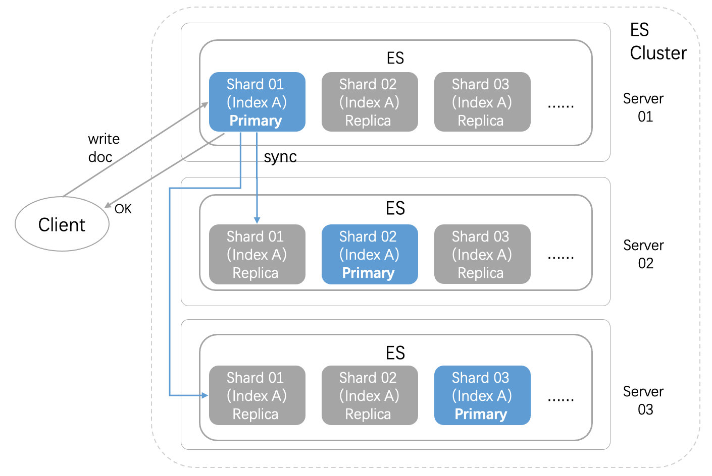

# Elasticsearch部署说明
本部署手册是帮助你快速在你的电脑上，下载安装并使用Elasticsearch分布式搜索引擎，也可参考官方文档部署. [Elasticsearch官方文档](https://www.elastic.co/guide/en/elasticsearch/reference/current/index.html)

### Elasticsearch集群架构图



### 一、Elasticsearch集群环境搭建

###### 注：本文以Centos7系统上搭建Elasticsearch 7.16.3 版本集群环境，如果是其他操作系统，请参考[官方文档](https://www.elastic.co/guide/en/elasticsearch/reference/7.16/rpm.html)部署

#### 1.1 准备工作
在部署Elasticsearch之前，需要确保以下环境和依赖已经安装和配置：
* 操作系统：Linux (CentOS, Ubuntu)
* Elasticsearch版本：选择合适的稳定<b>[版本](https://www.elastic.co/guide/en/elasticsearch/reference/current/rpm.html)</b>
* Elasticsearch的集群通常由3台或5台服务器组成（为了保证容错能力，Elasticsearch集群最好使用奇数台服务器);假设本次实验(192.168.10.11，192.168.10.12，192.168.10.13)

#### 1.2 安装Elasticsearch
在集群所有节点上安装Elasticsearch
```
安装签名密钥
# rpm --import https://artifacts.elastic.co/GPG-KEY-elasticsearch

添加yum安装源
# vi /etc/yum.repos.d/elasticsearch.repo
[elasticsearch]
name=Elasticsearch repository for 7.x packages
baseurl=https://artifacts.elastic.co/packages/7.x/yum
gpgcheck=1
gpgkey=https://artifacts.elastic.co/GPG-KEY-elasticsearch
enabled=1
autorefresh=1
type=rpm-md

查看可安装的elasticsearch版本
# yum --showduplicates list elasticsearch

安装
# yum install --enablerepo=elasticsearch elasticsearch-7.16.3 -y
```

#### 1.3 配置Elasticsearch
在es集群所有节点上配置如下参数
```
# vi /etc/elasticsearch/elasticsearch.yml
cluster.name: es-cluster  #集群名称，保持一致 
node.name: node-1   # 节点名称，确保不重复
network.host: 0.0.0.0 
node.roles: ["master", "data"]  # 节点角色，master和data
http.port: 9200   # HTTP 端口
transport.tcp.port: 9300 # 集群内通信端口
discovery.seed_hosts: ["192.168.10.11", "192.168.10.12", "192.168.10.13"] # 定义集群的候选主节点列表，用于节点加入时的发现
cluster.initial_master_nodes: ["192.168.10.11", "192.168.10.12", "192.168.10.13"] # 仅在首次启动集群时需要配置，用于指定集群启动时的候选主节点
index.number_of_shards: 5   # 分片数量
index.number_of_replicas: 1 # 副本数量
```

#### 1.4 启动Elasticsearch
```
# systemctl start elasticsearch
# systemctl enable elasticsearch
```

#### 1.5 启用集群节点通信安全认证
生成证书和密钥及创建密码只需在集群中一个节点上执行，其他节点只需要复制证书和密钥文件
```
生成证书
# /usr/share/elasticsearch/bin/elasticsearch-certutil ca

生成密钥
# /usr/share/elasticsearch/bin/elasticsearch-certutil cert --ca elastic-stack-ca.p12

将证书复制到Elasticsearch节点； 所有节点需要复制密钥
# mkdir /etc/elasticsearch/certs
# chown -R elasticsearch:elasticsearch /etc/elasticsearch/certs
# cp elastic-certificates.p12 /etc/elasticsearch/certs/
# chmod 644 /etc/elasticsearch/certs/elastic-certificates.p12

增加以下内容； 所有节点需要复制密钥
# vi /etc/elasticsearch/elasticsearch.yml
xpack.security.enabled: true
xpack.security.transport.ssl.enabled: true
xpack.security.transport.ssl.verification_mode: certificate
xpack.security.transport.ssl.keystore.path: /etc/elasticsearch/certs/elastic-certificates.p12
xpack.security.transport.ssl.truststore.path: /etc/elasticsearch/certs/elastic-certificates.p12

创建密码
# /usr/share/elasticsearch/bin/elasticsearch-setup-passwords auto
...............
...............
...............
Changed password for user elastic
PASSWORD elastic = 6U8asxECOALi3MZJsWkI

测试
# curl -X GET -u "elastic:6U8asxECOALi3MZJsWkI" http://192.168.10.11:9200/_cluster/health
```

#### 1.6 安装和配置Kibana
仅需在一个节点上执行
```
查看可安装的kibana版本
# yum --showduplicates list kibana

安装
# yum install --enablerepo=elasticsearch kibana-7.16.3 -y

配置
# vi /etc/kibana/kibana.yml
server.host: "0.0.0.0"
server.port: 5601
elasticsearch.hosts: ["http://192.168.10.11:9200"，"http://192.168.10.12:9200"，"http://192.168.10.13:9200"]
elasticsearch.username: "elastic"  # 创建密码时，创建的elastic用户名
elasticsearch.password: "6U8asxECOALi3MZJsWkI" # 创建密码时，创建的elastic密码

启动kibana
# systemctl start kibana
# systemctl enable kibana
```
浏览器访问：http://<your-server-ip>:5601


## 二、脚本安装
本文提供了shell脚本一键安装，先下载脚本install.sh，然后执行脚本，脚本会自动安装elasticsearch集群.

### 2.1 脚本执行前准备
* 需要提前配置好SSH免密登录，且保证节点间的操作系统一致
* 需要用root管理员用户执行该脚本，执行过程中会创建相应用户，避免因为权限导致脚本执行失败
* 确保 5601,9200,9300 端口没有被占用，避免因为端口冲突导致elasticsearch安装失败
* 必须配置IPLIST，其中1个es节点是执行脚本的主机，IPLIST则是es集群其他节点IP
* 脚本执行过程中，在生成证书时需要手动介入，不断敲回车键即可

### 2.2 脚本中变量说明
```
es_version="7.16.3"   # 必填，elasticsearch版本
es_data="/var/lib/elasticsearch" # 必填，elasticsearch数据目录，默认为/var/lib/elasticsearch
IPLIST="172.16.14.25;172.16.14.26"  # 必填，elasticsearch集群IP列表, 多个IP用分号隔开,至少2个节点，需要填写偶数个节点；es集群总节点数为IPLIST+1(这个节点为执行脚本的主机)
eth="ens192"             # 网卡名称，默认为ens192
```

### 2.3 脚本执行
+ 1）下载install.sh脚本，最好是下载到一个单独的目录中，执行过程中会生成一些临时文件，以便执行完毕后清理.
+ 2）修改install.sh脚本中变量的值，根据你自己的实际场景修改配置
+ 3）给脚本执行权限 chmod +x install.sh，执行脚本 bash install.sh
