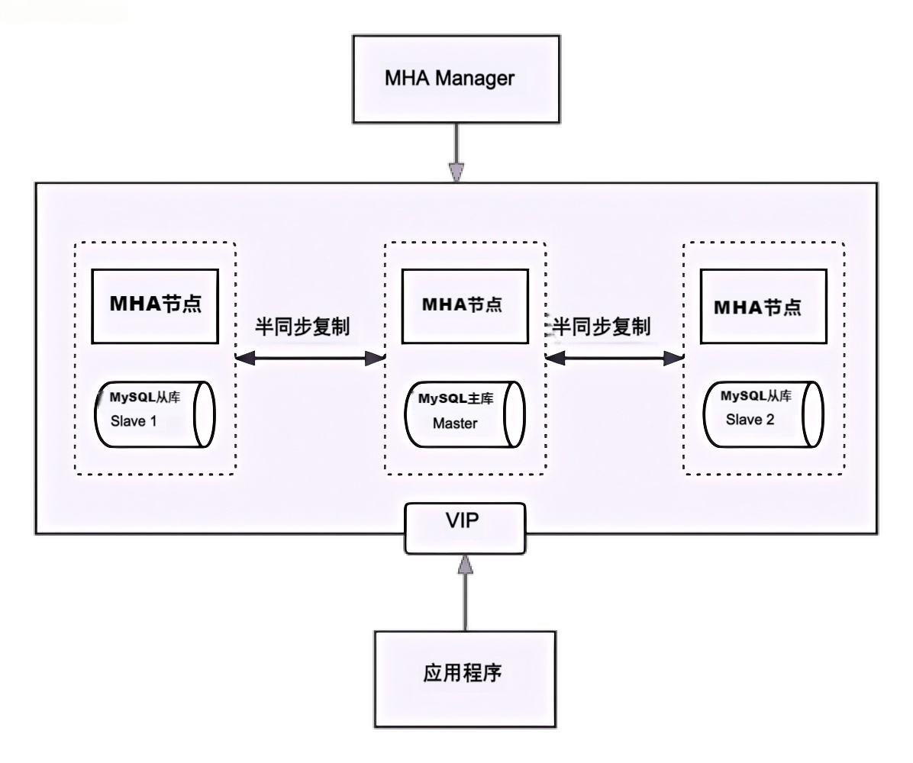

# MySQL MHA高可用模式
本部署手册是帮助你快速在你的电脑上，[下载](https://downloads.mysql.com/archives/community/)安装并使用MySQL，部署生产环境的MHA高可用模式. [MySQL官方文档](https://dev.mysql.com/doc/)，mha程序包[下载](https://github.com/yoshinorim/mha4mysql-manager/releases)

## MySQL MHA高可用部署架构图


### MySQL集群架构主要方案
+ MySQL Group Replication 是 MySQL 自带的原生集群方案，实现了多主架构（Multi-Master），允许集群中的所有节点同时进行读写操作；
+ MySQL InnoDB Cluster 是基于 MySQL Group Replication 的完整高可用集群解决方案，集成了 MySQL Router 和 MySQL Shell 等工具，提供了自动化的管理和故障恢复机制
+ MySQL Cluster 使用 NDB 存储引擎，是一个分布式、共享无存储架构，提供真正的水平扩展能力和高可用性。
+ MHA 是一个第三方开源工具，用于 MySQL 的主从复制环境，提供自动故障转移功能。
+ Galera Cluster 是一个同步多主复制解决方案，支持 MySQL、MariaDB 和 Percona XtraDB Cluster。
+ MySQL Fabric 是一种用于管理和自动化 MySQL 服务器群集的工具，支持自动分片（sharding）和高可用性管理
+ PXC (Percona XtraDB Cluster)‌是基于GaLera协议的高可用集群方案，实现了多个节点间的数据同步复制以及读写分离，适用于需要高性能和高可用性的应用

### 为什么选择MySQL MHA高可用模式
MySQL集群方案众多，选择MySQL MHA高可用模式，主要考虑以下几点：
+ MHA是国内中小型公司使用最多的方案，由于有广大的用户群体，经受各种业务场景的考验，遇到的问题，踩过的坑自然也多.
+ MHA网上文档内容丰富，文档中包含详细的配置说明，环境搭建，以及常见问题解决方案，方便用户快速上手
+ MHA是开源方案，无需购买额外的硬件或许可证，低实施成本
+ MHA拥有解决用户最核心痛点的能力：故障自动切换（Failover）、数据一致性和可用性、兼容性和扩展性等


## MySQL MHA高可用环境部署

### 1.1 环境说明
+ 服务器节点角色说明，准备4台机器用于部署MHA，1台部署mha管理节点，1台mysql主库，1台mysql备选主库，1台mysql从库.
  <table>
    <thead>
      <tr>
        <td>IP地址</td>
        <td>角色</td>
        <td>安装</td>
        <td>说明</td>
      </tr>
    </thead>
    <tbody>
      <tr>
        <td>192.168.100.11</td>
        <td>MHA管理节点</td>
        <td>mha-manager</td>
        <td>管理mysql master-slave集群</td>
      </tr>
    </tbody>
    <tbody>
      <tr>
        <td>192.168.100.12</td>
        <td>mysql master</td>
        <td>mha-node；mysql；keepalived</td>
        <td>mysql主库</td>
      </tr>
    </tbody> 
    <tbody>
      <tr>
        <td>192.168.100.13</td>
        <td>mysql slave</td>
        <td>mha-node；mysql；keepalived；配置mysql主从</td>
        <td>mysql备选主库(从库)</td>
      </tr>
    </tbody>
    <tbody>
      <tr>
        <td>192.168.100.14</td>
        <td>mysql slave</td>
        <td>mha-node；mysql；配置mysql主从</td>
        <td>mysql从库</td>
      </tr>
    </tbody>
    <tbody>
      <tr>
        <td>192.168.100.15</td>
        <td>vip</td>
        <td style="color: red">虚拟存在的IP</td>
        <td>由keepalived生成的心跳IP</td>
      </tr>
    </tbody>     
  </table>
+ 配置MHA管理节点与其他节点的SSH免密通信
+ 安装MySQL数据库，最好是5.7以上版本，确保所有MySQL实例版本相同，并配置MySQL主从复制
+ 在各角色节点安装MHA管理工具
+ 安装keepalived，生成心跳IP
+ 编写mha配置文件，故障自动切换脚本

### 1.2 配置SSH免密通信
在mha管理节点（192.168.100.11）上执行如下命令，实现SSH免密通信
```
# yum -y install sshpass
# sshpass -p ssh密码 ssh-copy-id -i ~/.ssh/id_rsa.pub -o StrictHostKeyChecking=no root@192.168.100.12
# sshpass -p ssh密码 ssh-copy-id -i ~/.ssh/id_rsa.pub -o StrictHostKeyChecking=no root@192.168.100.13
# sshpass -p ssh密码 ssh-copy-id -i ~/.ssh/id_rsa.pub -o StrictHostKeyChecking=no root@192.168.100.14
```

### 1.3 安装MySQL数据库
安装MySQL数据库，[配置](my.cnf)my.cnf参考,在192.168.100.12，192.168.100.13，192.168.100.14上执行
```
# usergroup mysql
# useradd -r -g mysql mysql
# mkdir -p /opt && cd /opt
# curl -o /opt/mysql-5.7.38-linux-glibc2.12-x86_64.tar.gz https://cdn.mysql.com/archives/mysql-5.7/mysql-5.7.38-linux-glibc2.12-x86_64.tar.gz
# tar -zxf mysql-5.7.38-linux-glibc2.12-x86_64.tar.gz

创建mysql数据目录
# mkdir -p /data/mysql5_7/{binlog,data,log,redolog,relaylog,undolog}
# chown -R mysql:mysql /data/mysql5_7

创建mysql配置文件
# vi /etc/my.cnf  
server-id = 12
port = 3306
character_set_server=utf8mb4
skip_name_resolve = 1
datadir = /data/mysql5_7/data
.....

初始化数据库
# /opt/mysql-5.7/bin/mysqld --initialize --user=mysql --defaults-file=/etc/my.cnf

查询初始密码
# grep 'temporary password'  /data/mysql5_7/log/error.log 

制作mysqld启动服务，参考 mysqld.service文件
# vi /etc/systemd/system/mysqld.service   

启动mysql服务
# systemctl daemon-reload
# systemctl enable mysqld
# systemctl start mysqld

修改密码
# mysql -uroot -p
mysql> set password=password('Qwert.12345');
```

配置MySQL主从复制
```
仅在192.168.100.12主库上执行
# mysql -uroot -p
mysql> CREATE USER 'repl'@'%' IDENTIFIED BY 'Asdf@1234';
mysql> GRANT REPLICATION SLAVE ON *.* TO 'repl'@'%';
mysql> FLUSH PRIVILEGES;
mysql> show master status;

在192.168.100.13， 192.168.100.14从库上执行
# mysql -uroot -p
mysql> change master to master_host='192.168.100.12', master_user='repl',master_password='Asdf@1234',MASTER_AUTO_POSITION=1;
mysql> start slave;
```
测试主从复制是否正常
```
在主库上执行
# mysql -uroot -p
mysql> create database test;
mysql> use test;
mysql> CREATE TABLE employees (
    id INT AUTO_INCREMENT PRIMARY KEY,
    name VARCHAR(100) NOT NULL,
    position VARCHAR(50)
);
mysql> insert into employees(name,position) values('张三','北京');

在从库上执行，如果可以查到数据，则表示主从复制正常
# mysql -uroot -p
mysql> use test;
mysql> select * from employees;
```
### 1.4 安装MHA管理工具
下面指令执行需要科学上网，国内用户很可能无法访问，最好用rpm,deb方式安装，编译安装较麻烦且容易出错
```
在mysql实例（192.168.100.12，192.168.100.13，192.168.100.14）上执行
# cd /opt
# curl -C - -o /opt/mha4mysql-node-0.58.tar.gz https://github.com/yoshinorim/mha4mysql-node/releases/download/v0.58/mha4mysql-node-0.58.tar.gz
# tar -zxf mha4mysql-node-0.58.tar.gz
# cd mha4mysql-node-0.58
# yum install -y perl-DBD-MySQL perl-Config-Tiny perl-Log-Dispatch perl-Parallel-ForkManager perl-ExtUtils-CBuilder perl-ExtUtils-MakeMaker perl-Mail-Sender perl-CPAN
# perl Makefile.PL && make && make install


在 mha管理节点（192.168.100.11）上执行
# cd /opt
# curl -C - -o /opt/mha4mysql-manager-0.58.tar.gz https://github.com/yoshinorim/mha4mysql-manager/releases/download/v0.58/mha4mysql-manager-0.58.tar.gz
# tar -zxf mha4mysql-manager-0.58.tar.gz
# cd mha4mysql-manager-0.58
# yum install -y epel-release
# install -y perl-DBD-MySQL perl-Config-Tiny perl-Log-Dispatch perl-Parallel-ForkManager perl-ExtUtils-CBuilder perl-ExtUtils-MakeMaker perl-Mail-Sender perl-CPAN
# perl Makefile.PL && make && make install

```

### 1.5 安装keepalived, 生成心跳IP
在192.168.100.12和192.168.100.13上安装，keepalived.conf配置[参考](keepalived.conf)
```
# yum install keepalived -y
# vi /etc/keepalived/keepalived.conf
.....
# systemctl enable keepalived
# systemctl start keepalived
```

### 1.6 启动mha管理服务
app.cnf配置[参考](app.cnf), mha服务启动脚本[参考](mhamanager.service)，故障自动切换脚本[参考](master_ip_failover)
```
该步骤只需要在192.168.100.12，192.168.100.13上执行
# mysql -uroot -p
mysql> GRANT ALL PRIVILEGES ON *.* TO 'mha'@'%' IDENTIFIED BY 'Zxcv.1234';
mysql> FLUSH PRIVILEGES;

下面步骤mha管理节点（192.168.100.11）上执行
# vi /usr/local/bin/master_ip_failover   // 修改故障自动切换脚本
......

# vi /data/masterha/app.cnf   // 参考 app.cnf
........ 

# vi /etc/systemd/system/mhamanager.service  // 参考 mhamanager.service
......
# systemctl daemon-reload
# systemctl enable mhamanager
# systemctl start mhamanager

# masterha_check_ssh --conf=/data/masterha/app.cnf  // 检查ssh
# masterha_check_repl --conf=/data/masterha/app.cnf  // 检查主从复制
# masterha_check_status --conf=/data/masterha/app.cnf  // 检查mha管理者状态
```

## 脚本安装
本文提供了shell脚本一键安装，支持MySQL单机版和主从版安装，先下载脚本install.sh，然后执行脚本，脚本会自动下载MySQL，并自动配置主从.

### 1.1 脚本执行前准备
+ 1）需要确保集群中所有节点时间一致
+ 2）确保集群中节点都配置了镜像仓库源，能正常用yum指令安装软件
+ 3）确保所有节点操作系统版本一致
+ 4）确保集群中节点网络互通，同时能够访问镜像仓库
+ 5）确保配置了SSH免密登录,并且该SSH用户具有管理员权限
+ 6）脚本仅支持MySQL >=5.7.2X 且 <=8.4.0以下版本安装.

### 1.2 脚本中变量说明

```
DEPLOY_MODE="cluster"   # 部署模式,cluster主从模式,standalone单机模式, 为单机模式时，部署在本机，无需填写IP_LIST, SSH_USER
IP_LIST="192.168.10.11 192.168.10.12 192.168.10.13"   # 主从模式，节点IP列表，格式为：192.168.10.11 192.168.10.12 192.168.10.13； 第一个IP为主节点IP，其他为从节点IP
SSH_USER="root"         # ssh用户，需自行提前配置ssh免密，最好是root, 因为需要创建用户
MYSQL_VERSION="8.0.36"        # 安装的mysql版本
MYSQL_ROOT_PASSWD="Qwert.12345" # mysql root密码, 密码必须8位以上且(有大小写字母、数字、特殊字符)；但是不要有单引号和双引号及空格.
MYSQL_REPL_USER="repl"          # 用于同步数据库的用户名
MYSQL_REPL_PASSWD="Zxcv.1234"   # 用于同步数据库的用户密码, 密码必须8位以上且(有大小写字母、数字、特殊字符)；但是不要有单引号和双引号及空格.
```

### 1.3 脚本执行
+ 1）下载install.sh脚本，最好是下载到一个单独的目录中，执行过程中会生成很多临时文件，以便执行完毕后清理.
+ 2）修改install.sh脚本中变量的值，根据你自己的实际场景修改配置
+ 3）给脚本执行权限 chmod +x install.sh，执行脚本 bash install.sh
