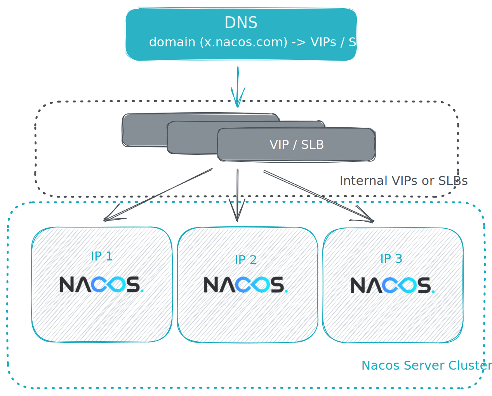

# Nacos集群模式
本部署手册是帮助你快速在你的电脑上，[下载](https://nacos.io/download/release-history/)安装并使用Nacos，部署生产使用的集群模式. [Nacos官方文档](https://nacos.io/docs/latest/what-is-nacos/)

## 集群部署架构图
无论采用何种部署方式，推荐用户把Nacos集群中所有服务节点放到一个vip下面，然后挂到一个域名下面。

<http://ip1:port/openAPI> 直连ip模式，机器挂则需要修改ip才可以使用。

<http://SLB:port/openAPI> 挂载SLB模式(内网SLB，不可暴露到公网，以免带来安全风险)，直连SLB即可，下面挂server真实ip，可读性不好。

<http://nacos.com:port/openAPI> 域名 + SLB模式(内网SLB，不可暴露到公网，以免带来安全风险)，可读性好，而且换ip方便，推荐模式


## Nacos部署

### 1.1 环境准备
+ 环境说明 

   准备3台机器用于部署Nacos服务，当然也可以用一台部署3个Nacos实例(每个实例端口不一致，生产环境不推荐)，配置SSH免密登录
+ 安装JDK

  Nacos服务需要java才能启动，需要提前安装java运行环境
+ 安装MySQL数据库

  安装数据库，版本要求：5.6.5+
  
  在MySQL数据库实例上创建nacos服务的数据库，同时创建用户名，并赋予权限
  
  初始化mysql数据库，数据库初始化文件：[mysql-schema.sql](mysql-schema.sql)
  
### 1.2 增加集群配置文件
在nacos的解压目录nacos/的conf目录下，增加配置文件cluster.conf，请每行配置成ip.（请配置3个或3个以上节点）
```
# ip:port
192.168.100.11:8848
192.168.100.12:8848
192.168.100.13:8848
```

### 1.3 修改Nacos配置文件
然后修改${nacos.home}/conf/application.properties文件，增加支持MySQL数据源配置，添加MySQL数据源的url、用户名和密码
```
spring.sql.init.platform=mysql

db.num=1
db.url.0=jdbc:mysql://${mysql_host}:${mysql_port}/${nacos_database}?characterEncoding=utf8&connectTimeout=1000&socketTimeout=3000&autoReconnect=true
db.user=${mysql_user}
db.password=${mysql_password}
```
开启默认鉴权插件（可选，推荐）

修改conf目录下的application.properties文件，配置如下内容
```
nacos.core.auth.enabled=true
nacos.core.auth.system.type=nacos
nacos.core.auth.plugin.nacos.token.secret.key=${自定义，保证所有节点一致}
nacos.core.auth.server.identity.key=${自定义，保证所有节点一致}
nacos.core.auth.server.identity.value=${自定义，保证所有节点一致}
```

上述内容详情可查看[权限认证](https://nacos.io/docs/latest/plugin/auth-plugin/).

注意，文档中的默认值SecretKey012345678901234567890123456789012345678901234567890123456789和VGhpc0lzTXlDdXN0b21TZWNyZXRLZXkwMTIzNDU2Nzg=为公开默认值，可用于临时测试，实际使用时请务必更换为自定义的其他有效值。


### 1.4 启动Nacos集群

在每个部署节点上，执行如下命名，逐台或同时启动Nacos节点。

```
# sh startup.sh
```

## 脚本安装
本文提供了shell脚本一键安装，支持Nacos单机版和集群版安装，先下载脚本install.sh，然后执行脚本，脚本会自动下载Nacos，并自动配置集群，并自动启动集群。

### 1.1 脚本执行前准备
+ 1）需要确保集群中所有节点时间一致
+ 2）确保集群中节点都配置了镜像仓库源，能正常用yum、apt指令安装软件
+ 3）提前安装MySQL数据库，并创建数据库nacos，创建用户名，并赋予权限, 并执行了该SQL脚本[mysql-schema.sql](mysql-schema.sql)
+ 4）确保集群中节点网络互通，同时能够访问镜像仓库
+ 5）确保启动了SSH服务，最好是提前配置了SSH免密登录
+ 6）关闭防火墙，关闭SELinux，确保服务器的8848端口没有被占用

### 1.2 脚本中变量说明
```
iplist="192.168.100.11 192.168.100.12 192.168.100.13"  # 集群节点ip列表，如果是集群模式，必须要3个节点
sshuser="root"                                         # 服务器ssh登录用户名
sshpasswd="password"                                   # ssh登录密码
jdk_path="/tmp/jdk-8u421-linux-x64.tar.gz"             # jdk安装包路径，可以是本地路径，也可以是http路径
nacos_path="/tmp/nacos-server-2.3.0.zip"               # nacos安装包路径，可以是本地路径，也可以是http路径
dt=$(date +%y%m%d)
WORKDIR="/opt/wmi$dt"                                  # 安装目录
LOGPATH="${WORKDIR}/install.log"                       # 安装日志文件
deploy_mode="cluster"                                  # 部署模式，cluster表示集群部署，standalone表示单机部署，如果是单机部署，则部署在脚本执行机器，如果是集群部署，则部署在iplist节点
nacos_dbhost="192.168.100.8"                           # 数据库地址
nacos_dbport="3306"                                    # 数据库端口
nacos_dbname="nacos"                                   # 数据库库名
nacos_dbuser="nacos"                                   # 数据库用户名
nacos_dbpasswd="dbpasswod"                             # 数据库密码
```

### 1.3 脚本执行
+ 1）下载install.sh脚本，最好是下载到一个单独的目录中，执行过程中会生成很多临时文件，以便执行完毕后清理.
+ 2）修改install.sh脚本中变量的值，根据你自己的实际场景修改配置
+ 3）给脚本执行权限 chmod +x install.sh，执行脚本 bash install.sh
