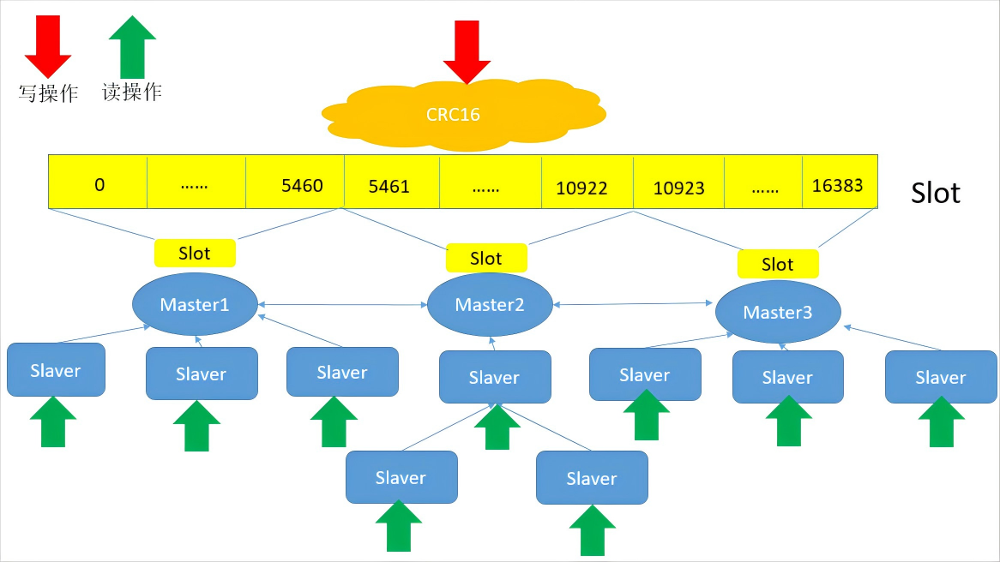

# Redis部署说明
本部署手册是帮助你快速在你的电脑上，[下载](https://download.redis.io/releases/)安装并使用Redis，部署生产使用的集群模式. [Redis官方文档](https://redis.io/docs/latest/)

## Redis集群部署架构图


<b>Redis集群（Redis Cluster）</b>是Redis的分布式实现，它允许数据分布在多个节点上，从而提供数据的高可用性和横向扩展性,Redis集群的主要原理
<br> <b> 数据分片 </b> <br>
Redis集群通过将数据分布在多个节点上来实现数据的水平扩展。数据分片是通过<b>哈希槽（hash slots）</b>来实现的。整个哈希空间共有16384个槽，Redis会根据每个键的CRC16校验值对16384取模来决定键存储在哪个槽中。每个节点负责一定数量的哈希槽。
<br> <b> 节点角色 </b> <br>
Redis集群包含两个角色：主节点（master）和从节点（Replica）,<b>主节点</b>：负责读写请求和数据的存储,每个主节点管理一定数量的哈希槽。<b>从节点</b>：用于数据的备份和在主节点故障时提供故障转移（Failover）。从节点通常不处理客户端请求，除非是读请求并且开启了读写分离。
<br> <b> 故障转移和高可用性 </b> <br>
如果某个主节点出现故障，集群中的从节点会自动提升为主节点，这个过程称为<b>故障转移（Failover）</b>。Redis集群通过投票机制来决定哪个从节点应该成为新的主节点，确保集群的高可用性。
<br> <b> 数据复制 </b> <br>
在Redis集群中，数据在主节点与其从节点之间进行异步复制。主节点会将其数据复制到一个或多个从节点，以便在主节点失效时能够进行故障转移。
<br> <b> 请求路由 </b> <br>
客户端在连接到Redis集群时，通常只需要知道集群中某个节点的地址。该节点会根据请求的键的哈希槽，将请求路由到正确的节点。如果客户端连接的节点不负责请求键的槽，它会将客户端重定向到负责该槽的节点。
<br> <b> 分区容错性 </b> <br>
Redis集群支持节点的自动重新配置。当有新的节点加入或现有节点发生变化时，集群可以自动调整哈希槽的分配，确保数据在所有节点间均衡分布，并且不会因为少量节点故障而导致整个集群不可用。
<br> <b> 集群配置管理 </b> <br>
Redis集群的配置信息存储在各个节点上，并通过Gossip协议在节点之间传播。这使得集群能够动态更新和同步配置数据，保证集群状态的一致性。


## Redis集群环境搭建

######  本文以Centos 7.X系统上安装Redis 6.2.8版本为例，其中部分指令不适用小于4.0版本，若安装小于4.0的版本，请参考官方文档部署

### 1.1 环境准备
+ 准备3台或6台机器用于部署Redis服务，如果是3台机器，每台安装2个Redis实例，如果是6台机器，每台安装1个Redis实例.
+ 确保集群中节点网络互通，能够访问Redis实例的端口，端口号默认为6379
+ 确保集群中节点都配置了镜像仓库源，能正常用yum、apt指令安装软件
+ 需要确保集群中所有节点时间一致，不要因为时间不一致导致集群异常

### 1.2 下载并安装Redis服务
```
# curl -o redis.tar.gz https://download.redis.io/releases/redis-6.2.8.tar.gz  // 下载安装包
# tar -zxvf redis.tar.gz
# cd redis-6.2.8

# yum install gcc jemalloc-devel -y   // 安装编译环境依赖包
# make MALLOC=libc && make install
```

### 1.3 配置Redis服务
redis.conf [配置样例](redis.conf)
```
# mkdir -p /opt/redis/{conf,data}
# vi /opt/redis/conf/redis-6379.conf
bind 0.0.0.0         # 绑定IP地址
protected-mode no    # 关闭保护模式
port 6379            # redis服务端口号，要根据你的实例情况配置，假如一台机器上配置了2个实例，建议端口号分别为6379和6380
daemonize no         # 禁用守护进程模式
pidfile /var/run/redis_6379.pid  # pid文件路径
loglevel notice                  # 日志级别
logfile "redis-6379.log"         # 日志文件路径
databases 16                    # 设置 Redis 的数据库数量
dir "/opt/redis/data"           # 定义持久化文件的存储目录
stop-writes-on-bgsave-error no  # 当 Redis 在执行 BGSAVE（后台保存 RDB 快照）操作时，如果发生错误，Redis 仍然会继续接受写操作
tcp-backlog 511  # 定义 TCP 连接队列的长度。这个值影响操作系统可以为等待完成的 TCP 连接维护的最大队列长度
timeout 0       # 客户端空闲连接的超时时间（秒）。当设置为 0 时，表示禁用超时。
tcp-keepalive 60  # 设置 TCP KEEPALIVE 超时时间（秒）。有助于在连接丢失时清除死连接
save 900 1           # 定义 RDB 快照保存条件。在这里，如果 900 秒内至少有 1 个键发生了变化，则触发 RDB 快照
save 300 10
save 60 3600
dbfilename "dump-6379.rdb"    # 定义 RDB 文件的名称，  要根据你的实例情况配置
rdbcompression yes            # 启用 RDB 文件的压缩功能
rdbchecksum yes               # 启用rdb 快照文件校验和功能
masterauth "abc123"           # 如果主节点设置了密码，从节点连接时需要提供这个密码进行验证
requirepass "abc123"          # 设置客户端连接 Redis 时需要提供的密码
repl-backlog-size 10mb        # 控制复制积压缓冲区的大小
maxclients 10000             # 限制最大客户端连接数。超出此限制后，Redis 将拒绝新连接
maxmemory 2gb                # 限制 Redis 可以使用的最大内存量
maxmemory-policy volatile-lru  # redis 内存淘汰策略，使用 LRU 算法删除最近最少使用的键
appendonly no                  # 关闭 AOF（Append Only File）持久化模式
appendfsync no                 # 设置 AOF 的同步频率，no 让操作系统决定同步时间，性能最好但最不安全
appendfilename "appendonly-6379.aof"  # 定义 AOF 文件的名称

slowlog-log-slower-than 30000  # 定义慢查询的时间阈值（微秒）。超过此时间的命令将被记录到慢查询日志中
slowlog-max-len 128  # 定义慢查询日志的最大条目数。超过此数量时，旧条目将被删除

cluster-enabled yes         # 启用 Redis 集群模式
cluster-config-file nodes-6379.conf  #定义 Redis 集群节点配置文件的名称
cluster-node-timeout 15000  # 定义 Redis 集群中节点通信超时的时间（毫秒）。如果超过这个时间未收到心跳包，该节点将被认为失效
cluster-require-full-coverage no

如果一台机器上配置了2个Redis实例，则配置如下：
# cp /opt/redis/conf/redis-6379.conf /opt/redis/conf/redis-6380.conf
# vi /opt/redis/conf/redis-6380.conf
# 其他不变，修改以下配置即可：
port 6380 
pidfile /var/run/redis_6380.pid
logfile "redis-6380.log" 
dbfilename "dump-6380.rdb" 
appendfilename "appendonly-6380.aof"
cluster-config-file nodes-6380.conf 
```

### 1.4 创建Redis系统服务文件
```
# vi /etc/systemd/system/redis-6379.service
[Unit]
Description=Redis In-Memory Data Store
After=network.target

[Service]
ExecStart=/usr/local/bin/redis-server /opt/redis/conf/redis-6379.conf
ExecStop=/usr/local/bin/redis-cli shutdown
Restart=always

[Install]
WantedBy=multi-user.target

# systemctl daemon-reload
# systemctl enable redis-6379.service  // 开机启动redis服务
# systemctl start redis-6379.service  // 启动Redis服务
```
###### 如果是6380，则创建 redis-6380.service, 同时修改 /opt/redis/conf/redis-6380.conf 即可

### 1.5 启动redis集群
###### 假设集群中节点为：192.168.10.101:6379 192.168.10.101:6380 192.168.10.102:6379 192.168.10.102:6380 192.168.10.103:6379 192.168.10.103:6380
```
# redis-cli --cluster create 192.168.10.101:6379 192.168.10.101:6380 192.168.10.102:6379 192.168.10.102:6380 192.168.10.103:6379 192.168.10.103:6380 --cluster-replicas 1
# redis-cli -c -h 127.0.0.1 -p 6379 -a abc123 cluster info  // 查看集群状态
```

## 脚本安装
本文提供了shell脚本一键安装，支持Redis单机版和集群版安装，先下载脚本install.sh，然后执行脚本，脚本会自动下载Redis，并自动配置集群。

### 1.1 脚本执行前准备
+ 1）需要确保集群中所有节点时间一致
+ 2）确保集群中节点网络互通，同时能够访问镜像仓库
+ 3）确保启动了SSH服务，最好是提前配置了SSH免密登录
+ 4）关闭防火墙，关闭SELinux，确保服务器的6379,6380,16379,16380 端口没有被占用
+ 5）确保脚本执行节点与iplist中的服务器配置了SSH免密登录

### 1.2 脚本中变量说明
```
deploy_mode="cluster" # 部署模式,cluster集群模式,standalone单机模式, 为单机模式时，部署在本机，无需填写iplist, sshuser, shhpasswd
iplist="192.168.100.11 192.168.100.12 192.168.100.13"  # 仅支持3台服务器和6台服务器，3台服务器时每台起2个Redis实例，6台服务器时每台起1个Redis实例
sshuser="root" # 单机模式，无需填写
sshpasswd="abc123" # 单机模式，无需填写
redis_version="6.2.8"   # 必须>=4.0版本
redis_passwd="abc123" # redis密码，默认为abc123

WORKDIR="/opt/wmi"    # 工作目录
LOGPATH="${WORKDIR}/redis/redis_install.log"  #日志路径
OSRELEASE=""   # 操作系统发行服务商，无需填写
redis_path=""  # redis文件路径，无需填写
```

### 1.3 脚本执行
+ 1）下载install.sh脚本，最好是下载到一个单独的目录中，执行过程中会生成很多临时文件，以便执行完毕后清理.
+ 2）修改install.sh脚本中变量的值，根据你自己的实际场景修改配置
+ 3）给脚本执行权限 chmod +x install.sh，执行脚本 bash install.sh

## Redis其他命令整理
```
# 启动Redis集群
redis-cli --cluster create 192.168.100.11:6379 192.168.100.11:6380 192.168.100.12:6379 192.168.100.12:6380 192.168.100.13:6379 192.168.100.13:6380 --cluster-replicas 1

# 查看集群状态
redis-cli -c -h 127.0.0.1 -p 6379 cluster info

查看集群节点
redis-cli -c -h 127.0.0.1 -p 6379 cluster nodes

# 测试用例
redis-cli -c -h 127.0.0.1 -p 6379
127.0.0.1:6379>set hello world
redis-cli -c -h 127.0.0.1 -p 6380
127.0.0.1:6380>get hello
redis-cli -c -h 192.168.100.11 -p 6379
192.168.100.11:6379>del hello

# 扩容集群节点
# 扩容时，先增加主节点，再增加从节点,可以在同一个节点 ,也可以在不同节点 ,推荐在不同节点
# 假设增加 192.168.100.15:6379（主） 和 192.168.100.15:6380(从) 两个实例

# 使用redis-cli的add-node命令新增一个主节点192.168.100.15:6379(master)，前面的ip:port为新增节点，后面的ip:port为集群中已存在的节点。
# 添加主节点
redis-cli --cluster add-node 192.168.100.15:6379 192.168.100.11:6379

# 添加从节点
redis-cli --cluster add-node 192.168.100.15:6380 192.168.100.11:6379 --cluster-slave --cluster-master-id <master-node-id>

# 另外一种方式 添加从节点
redis-cli --cluster add-node 192.168.100.15:6380 192.168.100.11:6379
# 挂载节点, 假设192.168.100.15:6379主节点id(990bb934a52a74ec9ebb2b73e9dc6016244293f6)
redis-cli -c -h 192.168.100.15 -p 6380 cluster replicate 990bb934a52a74ec9ebb2b73e9dc6016244293f6

#检查集群状态
redis-cli --cluster check 192.168.100.11:6379

# 注意：当添加节点成功以后，新增的节点不会有任何数据，因为它还没有分配任何的slot(hash槽)，我们需要为新节点手工分配hash槽。
# 重新分配槽位
# 注意：槽位迁移后，对应槽位中的数据也会迁移！

# 槽位迁移
redis-cli --cluster reshard 192.168.100.11:6379

--------------------------------------------------
How many slots do you want to move (from 1 to 16384)? 800
(ps:需要多少个槽移动到新的节点上，自己设置，比如600个hash槽)
What is the receiving node ID? 990bb934a52a74ec9ebb2b73e9dc6016244293f6  # 192.168.100.15:6379 节点id
(ps:把这600个hash槽移动到哪个节点上去，需要指定节点id)
Please enter all the source node IDs.
Type 'all' to use all the nodes as source nodes for the hash slots.
Type 'done' once you entered all the source nodes IDs.
Source node 1:all
(ps:输入all为从所有主节点(7000)中分别抽取相应的槽数指定到新节点中，抽取的总槽数为800个)
... ...
Do you want to proceed with the proposed reshard plan (yes/no)? yes
(ps:输入yes确认开始执行分片任务)
--------------------------------------------------

#集群缩容节点
#假设删除192.168.100.15:6379节点
#把192.168.100.15:6379 的槽位信息分配给 192.168.100.11:6379
redis-cli --cluster reshard 192.168.100.11:6379
-------------------------
[OK] All 16384 slots covered.
How many slots do you want to move (from 1 to 16384)? 800
What is the receiving node ID? 9037a70744f728d436a7c37e5e841f3b1ae3f099 (ps:这里输入192.168.100.11:6379节点id)
Please enter all the source node IDs.
Type 'all' to use all the nodes as source nodes for the hash slots.
Type 'done' once you entered all the source nodes IDs.
Source node #1: 990bb934a52a74ec9ebb2b73e9dc6016244293f6
(ps:这里是需要数据源，也就是我们的 192.168.100.15:6379 节点id)
Source node 2:done
(ps:这里直接输入done 开始生成迁移计划)
Do you want to proceed with the proposed reshard plan (yes/no)? Yes
(ps:这里输入yes开始迁移)
------------------------------------

# 删除 192.168.100.15:6379 主节点
redis-cli --cluster del-node 192.168.100.15:6379 990bb934a52a74ec9ebb2b73e9dc6016244293f6

# 删除 192.168.100.15:6380 从节点
redis-cli --cluster del-node 192.168.100.15:6380 6c15b61a14a10fdc8b122708b6240b9fe3cbb2f6

# 再次查看节点数量
redis-cli -c -h 192.168.100.11 -p 6379 cluster nodes

```
