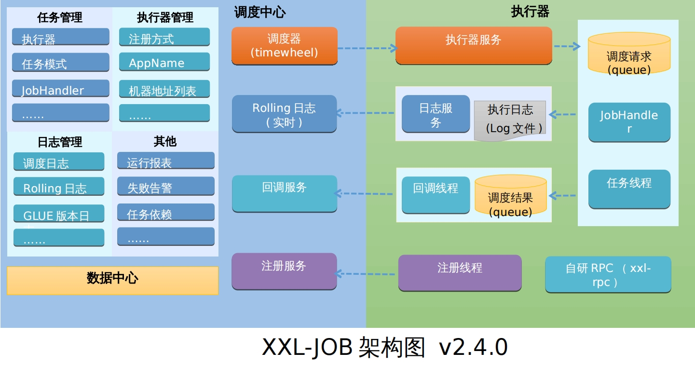

# XXL-JOB部署说明
本部署手册是帮助你快速在你的电脑上，下载安装并使用xxl-job分布式任务调度平台，也可参考官方文档部署. [xxl-job官方文档](https://www.xuxueli.com/xxl-job/)

### XXL-JOB 架构图


### xxl-job环境搭建

#### 1.1 环境准备
在部署 xxl-job 之前，需要确保以下环境和依赖已经安装和配置：
* 操作系统：Linux (CentOS, Ubuntu) 或 Windows
* Java 版本：JDK 1.8+
* 数据库：MySQL 5.7+ (用于存储调度任务的元数据)，最新xxl-job 2.4+版本，需要 MySQL 8.0+版本
* Web 容器：Tomcat 8.x 或更高（用于运行调度中心）
* Maven：3+版本，用于编译和打包 XXL-Job 项目

##### 1.1.1) [安装jdk](https://www.oracle.com/java/technologies/downloads/#java17) 
```
# curl -o jdk-17_linux-x64_bin.rpm  https://download.oracle.com/java/17/latest/jdk-17_linux-x64_bin.rpm
# yum localinstall jdk-17_linux-x64_bin.rpm

验证是否安装成功
# java -version 
```
##### 1.1.2) [安装maven](https://maven.apache.org/download.cgi)
```
# curl -o /usr/local/apache-maven-3.9.9-bin.tar.gz https://dlcdn.apache.org/maven/maven-3/3.9.9/binaries/apache-maven-3.9.9-bin.tar.gz
# tar -zxf /usr/local/apache-maven-3.9.9-bin.tar.gz -C /usr/local
# ln -s /usr/local/apache-maven-3.9.9 /usr/local/maven
# ln -s /usr/local/maven/bin/mvn /usr/local/bin/mvn

由于国外仓库比较慢，配置阿里云Maven中央仓库，打开/usr/local/maven/conf/settings.xml，在<mirrors></mirrors>标签中添加 mirror 子节点:
# vi /usr/local/maven/conf/settings.xml
<mirror>
    <id>aliyunmaven</id>
    <mirrorOf>*</mirrorOf>
    <name>阿里云公共仓库</name>
    <url>https://maven.aliyun.com/repository/public</url>
</mirror>

验证是否安装成功
# mvn -v
```

##### 1.1.3) [安装mysql](https://downloads.mysql.com/archives/community/)
```
安装mysql软件源
# curl -o mysql80-community-release-el7.rpm https://repo.mysql.com/mysql80-community-release-el7.rpm
# rpm -ivh mysql80-community-release-el7.rpm

安装mysql服务
# yum install mysql-community-server -y

创建xxl_job数据库和用户
# mysql -uroot -p
mysql> CREATE DATABASE xxl_job CHARACTER SET utf8mb4 COLLATE utf8mb4_general_ci;
mysql> CREATE USER 'xxljob'@'%' IDENTIFIED BY 'Asdf.1234';
mysql> GRANT ALL PRIVILEGES ON xxl_job.* TO 'xxljob'@'%';
mysql> FLUSH PRIVILEGES;
```

#### 1.2 xxl-job安装
##### 1.2.1) xxl-job编译打包
```
# curl -o /usr/local/2.4.1.tar.gz https://codeload.github.com/xuxueli/xxl-job/tar.gz/refs/tags/2.4.1
# tar -zxf /usr/local/2.4.1.tar.gz -C /usr/local
# cd /usr/local/xxl-job-2.4.1

修改配置, 数据库配置成你的数据库信息
# vi /usr/local/xxl-job-2.4.1/xxl-job-admin/src/main/resources/application.properties
server.port=8080
spring.datasource.url=jdbc:mysql://127.0.0.1:3306/xxl_job?useUnicode=true&characterEncoding=UTF-8&autoReconnect=true&serverTimezone=Asia/Shanghai
spring.datasource.username=xxljob
spring.datasource.password=Asdf.1234
spring.datasource.driver-class-name=com.mysql.cj.jdbc.Driver

编译打包
# mvn clean package
```

##### 1.2.2) 启动xxl-job服务
```
导入数据库脚本
# mysql -uroot -p xxl_job < /usr/local/xxl-job-2.4.1/doc/db/tables_xxl_job.sql

#nohup java -jar /usr/local/xxl-job-2.4.1/xxl-job-admin/target/xxl-job-admin-2.4.1.jar &
```

##### 1.2.3) 访问xxl-job服务
```
访问地址：http://<your-server-ip>:8080/xxl-job-admin/toLogin <br>
默认用户名密码: admin/123456
```

## 二、脚本安装
本文提供了shell脚本一键安装，先下载脚本install.sh，然后执行脚本，脚本会自动安装xxl-job.

### 2.1 脚本执行前准备
* 需要用root管理员用户执行该脚本，执行过程中会创建相应用户，避免因为权限导致脚本执行失败
* 确保服务器里面没有安装MySQL,jdk,Maven;安装过程中会使用全局环境变量,并且会覆盖原有执行指令
* 确保3306,8080端口没有被占用，避免因为端口冲突导致xxl-job安装失败

### 2.2 脚本中变量说明
```
xxl_job_version="2.4.1"    # 必填，xxl-job版本，如2.4.1 2.4.0 2.3.1等；
WORKDIR="/opt/wmi"         # 安装主目录
LOGPATH="/opt/wmi/xxl-job_install.log"  # 安装执行时的日志
mysql_data_dir="/var/lib/mysql"  # MySQL数据目录
mysql_root_passwd="Qwert.1234"   # mysql root用户密码
```

### 2.3 脚本执行
+ 1）下载install.sh脚本，最好是下载到一个单独的目录中，执行过程中会生成一些临时文件，以便执行完毕后清理.
+ 2）修改install.sh脚本中变量的值，根据你自己的实际场景修改配置
+ 3）给脚本执行权限 chmod +x install.sh，执行脚本 bash install.sh
